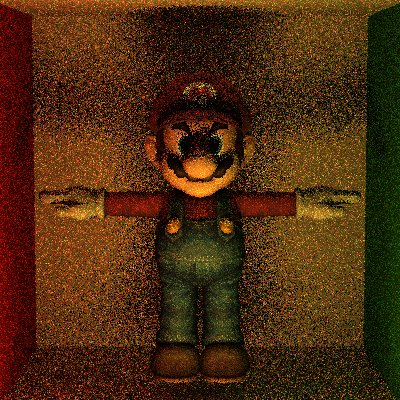

Path Tracer Episode VI: Return of the Acceleration Structures
======================

**University of Pennsylvania, CIS 561: Advanced Computer Graphics, Homework 8**

======================

* Name: Xi Yang
* PennKey: 43486159

======================

Results:
------------
wahoo(100 samples, 5 recursion limit)

Milliseconds to build BVH tree: 52

wahoo(1 sample, 5 recursion limit)

Milliseconds to render(with BVH):24002

Milliseconds to render(without BVH):583068

Custom Scenes:
------------

screw.jason

(400 samples, 8 recursion limit)

Milliseconds to build BVH tree: 111

stairs.jason

(400 samples, 8 recursion limit)

Milliseconds to build BVH tree: 127

Extra credits:
------------
Spectrum Class(please see scene/spectrum)

K-d Tree(please see scene/kdtreeaccel)